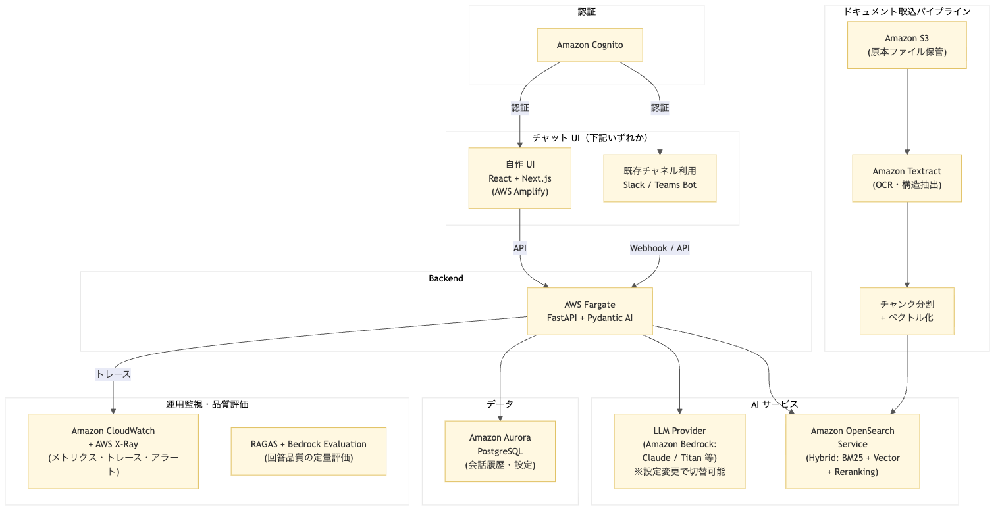

# RAG システムリプレイス — 構成案

リボルブ・シス様の既存検索システムをリプレイスする場合に考えられる構成。
Azure / AWS いずれの基盤でも実現可能な設計を示す。

---

## 現行システム

| 項目 | 値 |
|------|-----|
| ドキュメント数 | 5,503件 |
| チャンク数 | 39,152件 |
| ストレージ | 約5.09GB |
| 検索基盤 | Azure AI Search |
| DB | MySQL |
| 利用者数 | 12,000名（2027年4月〜24,000名） |
| 基盤 | AWS or Azure |

---

## クラウドサービス対応表

フレームワーク（Pydantic AI）とアプリケーション設計は共通。クラウド固有のサービスは以下の通り差し替え可能。

| 役割 | Azure | AWS |
|------|-------|-----|
| Backend | Azure App Service | AWS Fargate |
| 認証 | Azure AD B2C | Amazon Cognito |
| 検索 | Azure AI Search | Amazon OpenSearch Service |
| LLM | Azure OpenAI / 他プロバイダー | Amazon Bedrock / 他プロバイダー |
| ファイル保管 | Azure Blob Storage | Amazon S3 |
| OCR | Azure Document Intelligence | Amazon Textract |
| 運用監視 | Azure AI Foundry + Application Insights | Amazon CloudWatch + AWS X-Ray |
| 品質評価 | Azure AI Evaluation SDK | RAGAS + Amazon Bedrock Evaluation |
| DB | Azure Database for PostgreSQL | Amazon Aurora PostgreSQL |
| 静的 Web ホスティング | Azure Static Web Apps | AWS Amplify |

---

## 全体構成

クラウド基盤を統一すると、ネットワーク・認証・課金の管理が一元化できる。

### Azure 構成


| コンポーネント | 技術 | 役割 |
|--------------|------|------|
| チャット UI | Slack Bot / Teams Bot、または React + Next.js | ユーザーが質問を入力するインターフェース。既存チャネル利用か自作かは運用環境次第 |
| Backend | FastAPI + Pydantic AI（Azure App Service） | 質問を受け取り、検索・回答生成を実行する中核部分 |
| 認証 | Azure AD B2C | 24,000名規模のユーザー認証。SSO 対応 |
| 検索 | Azure AI Search | キーワード検索 + ベクトル検索 + AI リランキングのハイブリッド検索 |
| LLM | Azure OpenAI / Anthropic / Google 等 | 検索結果をもとに回答を生成する AI モデル。設定変更だけでプロバイダーを切替可能 |
| ファイル保管 | Azure Blob Storage | アップロードされた原本ファイルを保管 |
| OCR | Azure Document Intelligence | PDF・画像からテキスト・テーブル・構造を自動抽出 |
| 運用監視 | Azure AI Foundry + Application Insights | AI Foundry が AI の動作ログ・トークン消費量・応答速度を記録し、Application Insights がデータの保存・可視化・アラートを担当 |
| 品質評価 | Azure AI Evaluation SDK | 回答の正確さ、検索結果の適切さを定量的に評価 |
| DB | Azure Database for PostgreSQL | 会話履歴やユーザー設定を保存 |

### AWS 構成



| コンポーネント | 技術 | 役割 |
|--------------|------|------|
| チャット UI | Slack Bot / Teams Bot、または React + Next.js | ユーザーが質問を入力するインターフェース。既存チャネル利用か自作かは運用環境次第 |
| Backend | FastAPI + Pydantic AI（AWS Fargate） | 質問を受け取り、検索・回答生成を実行する中核部分 |
| 認証 | Amazon Cognito | 24,000名規模のユーザー認証。SAML / OIDC フェデレーション対応 |
| 検索 | Amazon OpenSearch Service | キーワード検索 + ベクトル検索のハイブリッド検索。search pipeline でスコア統合 |
| LLM | Amazon Bedrock（Claude, Titan 等） / OpenAI API / 他 | 検索結果をもとに回答を生成する AI モデル。Pydantic AI の設定変更だけでプロバイダーを切替可能 |
| ファイル保管 | Amazon S3 | アップロードされた原本ファイルを保管 |
| OCR | Amazon Textract | PDF・画像からテキスト・テーブル・フォームを自動抽出 |
| 運用監視 | Amazon CloudWatch + AWS X-Ray | CloudWatch がメトリクス・ログ・ダッシュボード・アラートを担当。X-Ray が分散トレーシング |
| 品質評価 | RAGAS + Amazon Bedrock Evaluation | OSS の RAGAS フレームワーク + Bedrock のモデル評価機能で回答品質を定量評価 |
| DB | Amazon Aurora PostgreSQL | 会話履歴やユーザー設定を保存。サーバーレス v2 で自動スケーリング可能 |

---

## バックエンドの実行方式（共通）

バックエンド（FastAPI + Pydantic AI）のデプロイ先として、常駐型コンテナサービスを採用する。

### クラウドネイティブなデプロイ先

| | Azure App Service | AWS Fargate（ECS） |
|---|---|---|
| 実行時間 | 無制限 | 無制限 |
| WebSocket | 対応 | 対応（ALB 経由） |
| コンテナ | Docker 対応 | Docker 必須 |
| スケーリング | 自動（プランに応じて） | タスク数ベースの自動スケーリング |
| 料金 | インスタンス課金（[料金表](https://azure.microsoft.com/ja-jp/pricing/details/app-service/linux/)） | vCPU + メモリの秒単位従量課金（[料金表](https://aws.amazon.com/jp/fargate/pricing/)） |
| 特徴 | Azure サービスとの統合が容易 | 柔軟な構成、VPC 統合 |

### Lambda を採用しない理由

AWS Lambda は実行時間の15分上限自体は多くのケースで収まるが、本質的な問題は**レスポンスのリアルタイム返却が難しい**点にある。

| 項目 | AWS Lambda | 常駐型（Fargate / App Service） |
|------|-----------|-------------------------------|
| WebSocket | 非対応（API Gateway WebSocket API で疑似対応は可能） | 対応 |
| レスポンスストリーミング | Lambda Response Streaming で対応可能だが、API Gateway 経由ではバッファリングされる制約あり | そのまま動作 |
| コールドスタート | あり（数百ms〜数秒） | なし |

LLM の回答生成は数秒〜数十秒、エージェンティック RAG の検索→評価→再検索ループでは数十秒〜1分超かかることもある。その間ユーザーにストリーミングで途中経過を返したいが、Lambda ではこれが素直にできない。WebSocket（Chainlit 等のチャット UI が前提とする通信方式）も Lambda 単体では非対応で、設計が大きく変わる。

常駐型のコンテナサービスであれば、WebSocket もストリーミングもそのまま動作する。

---

## チャット UI（共通）

バックエンド（検索・回答生成）は共通。フロントエンドは利用者の環境に応じて選択できる。

| パターン | 構成 | メリット |
|---------|------|---------|
| **既存チャネル利用** | Slack Bot / Teams Bot | UI 開発不要。導入が速い。利用者の学習コストがゼロ |
| **自作 UI** | React + Next.js | 独自のブランド体験や専用機能を実装できる |

自作 UI のホスティング先:
- **Azure →** Azure Static Web Apps
- **AWS →** AWS Amplify
- **クラウド非依存 →** Cloudflare Pages

Cloudflare Pages はバックエンドのクラウド基盤に依存しない選択肢。エッジ配信による高速表示、無料枠の広さ（無制限帯域）、GitHub 連携によるデプロイの手軽さが特徴。バックエンドが Azure でも AWS でも、フロントエンドだけ Cloudflare に置く構成が取れる。

---

## 検索の改善ポイント（共通）

### ハイブリッド検索

Azure AI Search / Amazon OpenSearch Service いずれも、セマンティック検索だけでなく複数の検索方式を組み合わせられる。現構成がセマンティック検索のみの場合、ハイブリッド構成に切り替えるだけで精度改善が見込める。

```
ユーザーの質問
    ↓
  ┌─ キーワード検索（BM25）：完全一致・部分一致に強い
  └─ ベクトル検索：意味的に近い文書を見つける
    ↓
  結果を統合（RRF アルゴリズム等）
    ↓
  リランキング（ML モデルによる再順位付け）
    ↓
  上位の結果を LLM に渡して回答生成
```

### Azure AI Search vs Amazon OpenSearch Service

| 観点 | Azure AI Search | Amazon OpenSearch Service |
|------|-----------------|--------------------------|
| ハイブリッド検索の設定 | API パラメータで指定。設定が簡潔 | search pipeline の事前設定が必要 |
| マネージド ML リランカー | Semantic Ranking（組み込み） | なし。ML Commons または Bedrock Rerank API を利用 |
| サーバーレス版 | なし（SKU でスケール調整） | OpenSearch Serverless（一部プラグイン制限あり） |
| 埋め込み生成 | 統合ベクトル化（インデクサーで自動生成可） | Neural Search プラグイン or アプリ側で生成 |

Azure AI Search は Semantic Ranking（マネージド ML リランカー）を API パラメータの追加だけで有効化でき、追加のモデルデプロイが不要。OpenSearch は search pipeline の事前設定が必要で、リランキングも ML Commons プラグインまたは Amazon Bedrock Rerank API を別途利用する構成になる。

### エージェンティック RAG

従来の RAG は「1回検索して回答」の1パス。エージェンティック RAG では AI が検索結果を評価し、不十分なら自律的にクエリを修正して再検索する。人間が「検索語を変えてもう一度探す」のと同じ動き。

---

## ドキュメント取込パイプライン

### ファイルの流れ（共通）

```
ファイルアップロード → オブジェクトストレージに保管 → OCR（テキスト抽出）→ チャンク分割 → ベクトル化 → 検索インデックスに登録
```

| ステップ | Azure | AWS |
|---------|-------|-----|
| ファイル保管 | Azure Blob Storage | Amazon S3 |
| OCR | Azure Document Intelligence | Amazon Textract |
| ベクトル化 | Azure OpenAI Embeddings / 他 | Amazon Bedrock Embeddings（Titan Embeddings 等） / 他 |
| インデックス登録 | Azure AI Search | Amazon OpenSearch Service |

### OCR（文字認識）

ドキュメントの種類によってテキスト抽出の方式が変わる。

| ドキュメントの状態 | 処理方式 |
|------------------|---------|
| デジタル PDF（テキスト埋め込み済み） | テキスト抽出のみ。OCR 不要 |
| スキャン PDF / 画像（印刷文字） | OCR でテキスト抽出 |
| スキャン PDF / 画像（手書き文字） | OCR（手書き対応モデル） |
| 劣化が激しい画像（古い FAX 等） | 高精度 OCR やカスタムモデルの検討が必要 |

**Azure Document Intelligence vs Amazon Textract:**

| | Azure Document Intelligence | Amazon Textract |
|---|---|---|
| テキスト抽出 | ○ | ○ |
| テーブル抽出 | ○（高精度） | ○ |
| フォーム抽出 | ○（Key-Value ペア） | ○（Key-Value ペア） |
| 手書き認識 | ○ | ○ |
| レイアウト分析 | ○（セクション・段落の構造化が強い） | ○（Layout API） |
| カスタムモデル | ○（Custom Document Model） | ○（Custom Queries） |
| 多言語 | 100+ 言語 | 100+ 言語 |
| 特徴 | ドキュメント構造の理解に強み | S3 直接連携。非同期処理で大量ドキュメントに対応 |

**クロスクラウド構成の選択肢:** AWS 基盤であっても、OCR だけ Azure Document Intelligence を使う構成もあり得る。Azure Document Intelligence はドキュメント構造の理解（セクション・段落・テーブルの階層構造の抽出）に強みがあり、構造化が重要なドキュメントが多い場合はクラウドをまたいででも採用する価値がある。S3 からファイルを取得 → Azure Document Intelligence で OCR → 結果を OpenSearch に登録、というパイプラインで実現可能。

### ライフサイクル管理（共通）

ドキュメントの追加・更新・削除が検索インデックスに正しく反映される設計が重要。

| 課題 | 確認ポイント |
|------|------------|
| 新規追加 | アップロードから検索可能になるまでのパイプラインが自動化されているか |
| 重複 | 同一ファイルの再アップロード時にデータが重複しないか |
| 更新 | ドキュメント改訂時に旧データが適切に差し替えられるか |
| 削除 | ドキュメント削除時に検索インデックスからも確実に除去されるか |

**パイプラインの実装パターン:**

| | Azure | AWS |
|---|---|---|
| イベント駆動 | Blob Storage → Event Grid → Functions | S3 → EventBridge → Lambda |
| バッチ処理 | Azure AI Search インデクサー（スケジュール実行） | Step Functions + Lambda（バッチジョブ） |
| 特徴 | インデクサーが自動でデータソースを巡回・更新 | Step Functions でパイプライン全体をオーケストレーション |

---

## 運用監視・品質評価

AI システムは従来のソフトウェアと異なり、「正しく動いているか」を継続的に監視・評価する仕組みが不可欠。

### 運用監視

#### Azure: Azure AI Foundry + Application Insights

| サービス | 役割 |
|---------|------|
| **Azure AI Foundry** | AI 固有の情報を自動記録。どの AI モデルが呼ばれたか、トークン消費量、使われたツール等 |
| **Application Insights** | 記録されたデータを保存・可視化。ダッシュボード、アラート通知、過去データの検索・分析 |

#### AWS: Amazon CloudWatch + AWS X-Ray

| サービス | 役割 |
|---------|------|
| **Amazon CloudWatch** | メトリクス・ログ・ダッシュボード・アラート。アプリ全体の運用監視基盤 |
| **AWS X-Ray** | 分散トレーシング。OpenTelemetry 互換。リクエスト単位でツールコール・LLM 呼び出しを追跡 |
| **Amazon Bedrock Model Invocation Logging** | Bedrock 利用時のトークン消費量・レイテンシ・入出力ログを自動記録。CloudWatch / S3 にエクスポート |

**LLM 特化 Observability ツールとの併用（共通）:** Pydantic AI は OpenTelemetry に対応しているため、上記クラウド監視サービスに加えて Langfuse 等の LLM 特化ツールを併用する選択肢もある。クラウド監視で運用メトリクスを取りつつ、LLM 固有のトレース可視化やプロンプト管理は専用ツールに任せる、という構成が考えられる。

### 品質評価

回答の品質を定量的に評価する仕組み。

#### Azure: Azure AI Evaluation SDK

以下の3観点（RAG Triad）で測定する。

| 観点 | 測定内容 |
|------|---------|
| **Retrieval（検索精度）** | 検索された文書がユーザーの質問に関連しているか |
| **Groundedness（根拠性）** | 回答が検索結果に基づいているか（AI が勝手に情報を作っていないか） |
| **Relevance（適合性）** | 最終的な回答がユーザーの質問に答えているか |

マネージドサービスのため、SDK を導入するだけで評価パイプラインが構築できる。

#### AWS: RAGAS + Amazon Bedrock Evaluation

AWS には Azure AI Evaluation SDK に直接対応するマネージドサービスはない。以下のアプローチで同等の品質評価を実現する。

| アプローチ | 概要 |
|-----------|------|
| **RAGAS（OSS）** | RAG 品質評価のデファクトスタンダード。クラウド非依存。Azure 環境でも使用可能 |
| **Amazon Bedrock Evaluation** | Bedrock 上のモデル評価機能。LLM-as-judge による自動評価に対応 |
| **カスタムパイプライン** | Step Functions + Lambda で定期バッチ評価を構築。結果を CloudWatch ダッシュボードに表示 |
| **Langfuse（OSS）** | LLM アプリ向けの Observability + Evaluation プラットフォーム。トレース・プロンプト管理・評価を一体化。セルフホスト可能。RAGAS との統合もサポート |

**Langfuse について:** 評価パイプラインの選択肢の一つ。LLM 固有のトレース可視化（ツールコールの検査、トークン消費量）やプロンプトの A/B テスト、データセット管理などの機能を持つ。クラウド非依存で Azure / AWS いずれの環境でも使える。

### RAGAS（共通）

**RAGAS**（Retrieval Augmented Generation Assessment）は、RAG システムの回答品質を自動で定量評価するための OSS フレームワーク。人手で回答を一つずつ確認するのではなく、LLM を評価者（judge）として使い、大量の回答を自動的にスコアリングできる。クラウド非依存のため Azure / AWS いずれの環境でも動作する。

**評価指標:**

| 指標 | 測定内容 |
|------|---------|
| **Faithfulness（根拠性）** | 回答が検索結果に基づいているか。AI が検索結果にない情報を勝手に作っていないかを検出 |
| **Answer Relevancy（回答適合性）** | 最終的な回答がユーザーの質問に答えているか |
| **Context Precision（文脈精度）** | 検索された文書のうち、実際に回答に役立ったものの割合 |
| **Context Recall（文脈再現率）** | 正解を導くために必要な情報が検索結果に含まれていたか |
| **Answer Correctness（回答正確性）** | 正解データ（Ground Truth）がある場合、回答がどれだけ正確か |

**使い方のイメージ:**
```python
from ragas import evaluate
from ragas.metrics import faithfulness, answer_relevancy, context_precision

# 評価データセット（質問・回答・検索結果・正解のセット）
result = evaluate(
    dataset,
    metrics=[faithfulness, answer_relevancy, context_precision],
)
print(result)  # 各指標のスコア（0〜1）
```

**Azure AI Evaluation SDK との関係:** Azure AI Evaluation SDK の RAG Triad（Retrieval / Groundedness / Relevance）と測定観点はほぼ同じ。Azure SDK はマネージドサービスで導入が簡単、RAGAS は OSS で柔軟にカスタマイズできるという違い。Langfuse と統合すればスコアの記録・可視化も可能。

---

## フレームワーク選定（共通）

### 実装アプローチの比較

AI エージェントの実装には3つのアプローチがある。

| アプローチ | 代表 | Agent Loop | 向いているケース |
|-----------|------|-----------|----------------|
| フレームワーク不使用 | LLM API + 自前ループ | 自分で書く（数十行） | 依存を最小にしたい、完全制御が必要 |
| Chain/Graph型 | LangChain, LangGraph | 自分でフロー定義・接続 | 複雑なワークフロー、明示的な制御が必要 |
| Agent Runtime型 | Pydantic AI, Claude Agent SDK, OpenAI Agents SDK | フレームワークに組み込み済み | Single agent、API backend、structured output |

フレームワーク不使用も現実的な選択肢。LLM API 自体がツール呼び出しに対応しており、Agent loop は自作可能。フレームワークのバージョン変更に振り回されない利点がある。

### Pydantic AI を選ぶ理由

- **LLM の自由な選択**: Azure OpenAI、Amazon Bedrock（Claude, Titan）、Anthropic、Google（Gemini）など 20 以上の AI モデルに対応。設定変更だけで切り替えられる
- **Agent loop が組み込み済み**: ツール定義だけでエージェントが動く。フローを自分で組み立てる必要がない
- **型安全**: Pydantic validation + IDE サポート。ツール定義がデコレータ + 型ヒントだけ
- **クラウド非依存**: OpenTelemetry 標準で Azure / AWS いずれの運用監視サービスとも接続可能

### Pydantic AI のプロダクションレディネス

| 項目 | 詳細 |
|------|------|
| 現バージョン | v1.68.0（2026-03-13） |
| GA リリース | v1.0.0（2025-09-04） |
| PyPI 分類 | `5 - Production/Stable` |
| GitHub Stars | 15,459 |
| Contributors | 387人 |
| ライセンス | MIT |

**API 安定性コミット:**
> "we're committed to API stability: we will not introduce changes that break your code until V2."

**注意点:**
- Pydantic Graph（マルチエージェント）は Beta API
- v0.x → v1.0 で `result` → `output` のリネームあり（古い記事に注意）
- リリース頻度が高い（週1-2回）ので依存バージョンの固定を推奨

### フレームワーク交換のリスクは低い

フレームワークが担うのは「AI モデルの呼び出しとツール実行のループ制御」に限定される。検索ロジック、認証、API 設計などはフレームワークの外にあるため、変更してもシステム全体の作り直しにはならない。Coding Agent を使えば、定型的な書き換え作業はさらに効率化できる。

### LangChain / LangGraph について

LangChain / LangGraph も広く使われているフレームワーク。v1.0（2025年10月）以降は安定しており、実務でも問題なく使える。LangChain v1.2.12 / LangGraph v1.1.0（2026年3月時点）。v0.x 時代の破壊的変更が収まり、実務での信頼性が向上した。

Pydantic AI を選ぶ理由は LangChain の否定ではなく、用途が Single agent の RAG であり、Agent Runtime型の方がシンプルに実装できるという判断。複雑なワークフロー制御が必要になれば LangGraph も選択肢に入る。

### フレームワーク選定で最も重要なのは LLMOps

フレームワークの機能差は時間とともに収束する。差がつくのは**品質評価（LLMOps）の仕組みが組み込まれているかどうか**。

LLM アプリは従来のソフトウェアと違い、出力の正しさを単体テストで保証できない。本番運用には以下が不可欠:

- リクエスト単位のトレース（どのツールが呼ばれ、何が返ったか）
- トークン使用量・コスト・レイテンシの継続的モニタリング
- 検索精度の定量評価（Recall, Precision, MRR 等）
- A/B テストやプロンプト変更の影響測定

Pydantic AI は OpenTelemetry に対応しており、クラウド監視サービス（Application Insights / CloudWatch）や LLM 特化ツール（Langfuse 等）と柔軟に統合できる。特定の Observability ツールに縛られない点が強み。

---

## 確認事項

構成を詰めるにあたって確認が必要な情報。

### 素材（ソースメディア）

- **素材のメディア種別は？** ドキュメント（PDF, Word, Excel 等）のみか、動画・音声も含むか？ → 動画が含まれる場合、文字起こしやフレーム抽出の仕組みが追加で必要
- **ドキュメントの生成方法は？** デジタル作成（Word → PDF）か、紙をスキャンした画像 PDF か？ → スキャン画像の場合は OCR の精度要件が上がる。手書きやかすれた印字が含まれるとさらに高精度な処理が必要
- **テーブル、図表、フローチャート等は含まれるか？** → テーブル抽出は標準機能で対応可能だが、図表の意味理解には追加設計が必要な場合がある
- **ドキュメントの言語は？** 日本語のみか、多言語混在か？ → OCR・検索の各レイヤーで言語対応の設計が変わる

### ファイルライフサイクル

- **更新頻度は？** 日次 / 週次 / 月次？ → 取込パイプラインの設計に影響
- **バージョン管理は必要か？** 旧版も検索対象に残すか、最新版のみか → データの世代管理の設計に影響
- **同一ドキュメントの重複登録が発生する運用か？** → 重複検知・排除のロジックが必要かどうか

### チャット UI

- **利用者は普段 Slack や Teams を使っているか？** → 既存チャネルに Bot を追加する方が導入が早く、UI 開発不要
- **独自の Web チャット UI が必要か？** → 自作する場合はフロントエンド開発が追加で必要になり、スコープが変わる

### 現行システム

- **現行の Azure AI Search はどの検索方式を使っているか？** → 検索設定の変更だけで改善できる可能性がある（リプレイス不要の場合も）
- **チャット体験以外に改善したい点はあるか？**（管理画面、レポート等） → スコープが広がると金額・期間が変動
- **認証基盤は何を使っているか？**（Azure AD / Amazon Cognito / 独自認証 / SSO） → 既存の認証基盤に合わせた設計が効率的

### クラウド基盤

- **メインのクラウド基盤は Azure / AWS どちらか？** → コンポーネント選定の前提が変わる。混在環境ではネットワーク設計に注意
- **既存のクラウドリソース（VPC / VNet、IAM、監視等）で流用できるものはあるか？** → 既存リソースを活用することで構築コスト・期間を短縮できる
